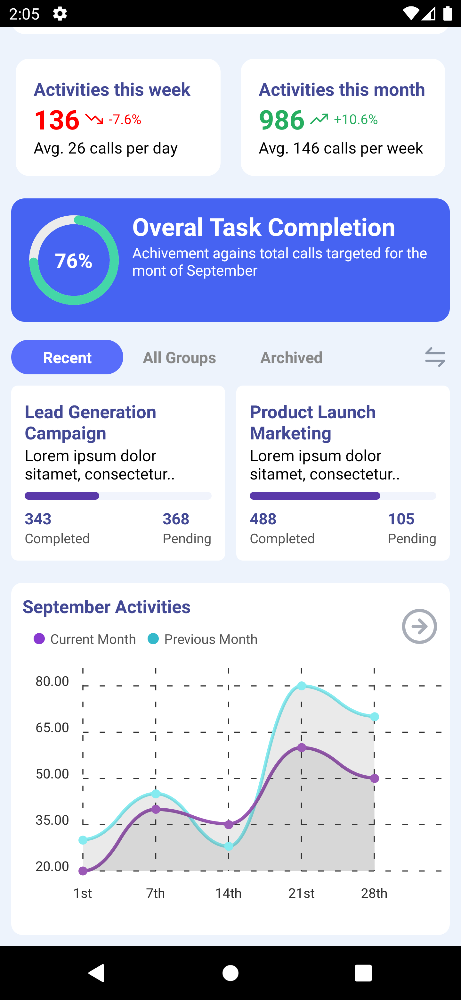

# 🚀 React Native Project

This is a new [**React Native**](https://reactnative.dev) project, bootstrapped using [`@react-native-community/cli`](https://github.com/react-native-community/cli).

## 📸 App Preview

### Images

| i1 | i2 |
|----|----|
|  |  |

| i3 | i4 |
|----|----|
|  |  |

### 📹 App Video


> **Note**: Replace the image and video paths with actual file paths or URLs in your project.

---

## 🛠️ Getting Started

> **Note**: Make sure you have completed the [Set Up Your Environment](https://reactnative.dev/docs/set-up-your-environment) guide before proceeding.

### Step 1: Start Metro

```sh
npm start
# OR
yarn start
```

### Step 2: Build and run your app

#### Android

```sh
npm run android
# OR
yarn android
```

#### iOS

```sh
bundle install
bundle exec pod install

npm run ios
# OR
yarn ios
```

### Step 3: Modify your app

Edit `App.tsx`, save and enjoy **Fast Refresh**.

### Full Reload Shortcuts

- **Android**: `R` twice or `Cmd/Ctrl + M`
- **iOS**: Press `R` or use the Dev Menu

---

## 📚 React Native Quick Guide

### 🔥 What is React Native?

React Native is an open-source framework for building native apps using **JavaScript** and **React**.

### Features:

- Cross-platform (iOS & Android)
- Native performance
- Reuse business logic
- Hot reload & Fast refresh
- Native module support

### Common CLI Commands

#### Initialize project

```sh
npx react-native init MyApp
```

#### Install packages

```sh
npm install
# OR
yarn install
```

#### Start Metro

```sh
npm start
# OR
yarn start
```

#### Run on Android

```sh
npx react-native run-android
```

#### Run on iOS

```sh
npx react-native run-ios
```

#### Clean Android build

```sh
cd android && ./gradlew clean && cd ..
```

### Debugging

- Dev Menu: `Cmd/Ctrl + M` (Android), `Cmd + D` (iOS)
- Use Flipper for deep inspection
- Chrome Debugging: Enable via Dev Menu

### Recommended Packages

| Package                                      | Purpose                          |
|----------------------------------------------|----------------------------------|
| `react-navigation`                           | Routing and navigation           |
| `axios` or `fetch`                           | API requests                     |
| `@react-native-async-storage/async-storage`  | Local storage                    |
| `react-native-vector-icons`                  | Icons                            |
| `react-native-reanimated`                    | Animations                       |

---

## 🎉 Congratulations

You’ve successfully created and run a React Native app!

### Learn More

- [React Native Docs](https://reactnative.dev/docs/getting-started)
- [Blog](https://reactnative.dev/blog)
- [GitHub Repo](https://github.com/facebook/react-native)
